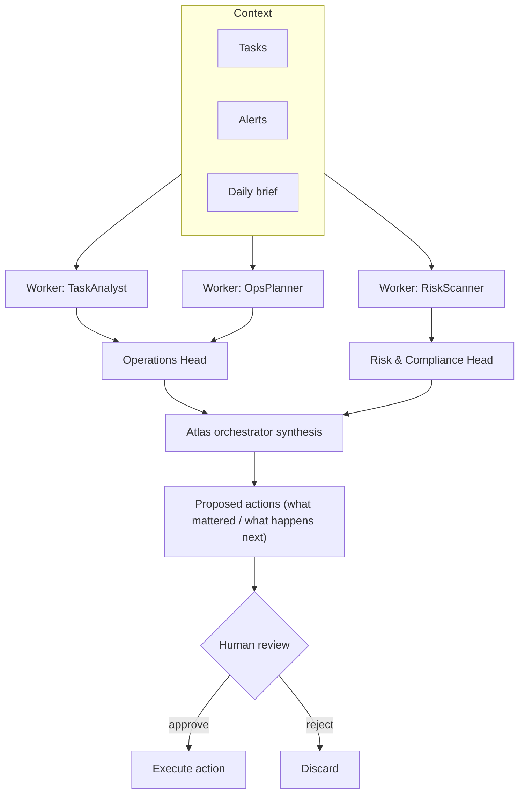
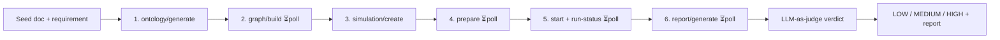

# ATLAS — a multi-agent personal operating company

[](https://github.com/Hasnain91169/ATLAS/actions/workflows/ci.yml)
[](https://www.python.org/)
[](LICENSE)

ATLAS runs your work like a small company staffed by LLM agents. Specialist
**workers** analyze your tasks, alerts, and calendar; **department heads**
(Operations, Risk & Compliance, Finance, Learning) synthesize their workers into
domain reports; an **orchestrator** merges those into "what mattered / what
happens next" and a short list of **actions you approve** before anything runs.

On top of that decision loop, ATLAS can **rehearse the future**: give it a message
or announcement and it drives [MiroFish](https://github.com/666ghj/MiroFish) — a
self-hosted, multi-agent social simulator — to predict how an audience will react
*before* you send it, returning a report and a `LOW`/`MEDIUM`/`HIGH` risk verdict.

> Personal project. Built to explore production-shaped agent engineering:
> hierarchical multi-agent orchestration, LLM-as-judge with fail-open fallbacks,
> a reverse-engineered async integration, and human-in-the-loop approval.

## Live demo

An interactive **offline** tour (no keys, no cost) is in
[streamlit_app.py](streamlit_app.py): rehearse an audience reaction, run the eval
harness, and watch a traced org run with cost totals. Run it locally with
`streamlit run streamlit_app.py`, or deploy free to
[Streamlit Community Cloud](https://share.streamlit.io) straight from this repo
(`requirements.txt` + `streamlit_app.py` are included).

[](https://atlas-demo.streamlit.app)

## Engineering highlights

- **Hierarchical multi-agent orchestration** — workers → department heads →
  orchestrator synthesis → human-approved actions, each layer a typed contract
  ([atlas/org/](atlas/org/orchestrator.py), [atlas/org/protocol.py](atlas/org/protocol.py)).
- **Real agent loop, not prompt-chaining** — `atlas org run --agent` runs each head
  as a bounded ReAct-style tool-use agent (`query_tasks` / `query_alerts` /
  `read_brief`) driven by structured outputs, with a max-steps guard
  ([atlas/org/agent.py](atlas/org/agent.py)).
- **Tracing & cost observability** — `atlas org run --trace` records a span tree
  (worker → synthesis → head / agent step) with per-call tokens, latency, and USD
  cost, persisted to SQLite and viewable via `atlas org trace <id>`
  ([atlas/org/trace.py](atlas/org/trace.py)).
- **Hallucination guard on tool use** — LLM-proposed actions are dropped unless
  their `task_id`/`list_id` appear in the provided context, and are auto-converted
  into a "request more info" action otherwise
  ([`_post_validate_actions`](atlas/org/roles.py)).
- **Reverse-engineered a black-box multi-agent simulator** — MiroFish ships no API
  docs; the client was built by reading its Flask source, unwrapping a
  `{success, data}` envelope, and modeling a **6-stage async pipeline** as a polled
  state machine with wall-clock deadlines ([atlas/prediction/mirofish.py](atlas/prediction/mirofish.py)).
  See the [case study](docs/case-study-mirofish.md).
- **LLM-as-judge with fail-open fallback** — audience reports are classified into a
  risk verdict by an LLM, degrading gracefully to a deterministic keyword heuristic
  when no model is configured or its output is unusable
  ([atlas/prediction/assess.py](atlas/prediction/assess.py)).
- **Eval harness** — `atlas evals run` scores the verdict judges against a labeled
  golden set (accuracy, per-class confusion, heuristic↔LLM agreement, latency) and
  persists results. It's how we *know* the keyword heuristic underperforms the LLM
  judge, not just assume it ([atlas/evals/](atlas/evals/runner.py)).
- **Provider-agnostic + local models** — any OpenAI-compatible endpoint, including
  local Ollama/LM Studio ([atlas/llm/](atlas/llm/base.py)).
- **Tested like production** — 70+ tests, including **fully mocked network
  pipelines** (the entire MiroFish 6-stage flow is exercised without a backend) and
  deterministic offline stubs, green in CI across Python 3.11–3.13.

## Architecture

### The org decision loop



### The MiroFish audience-prediction pipeline



## Quick start

```bash
git clone https://github.com/Hasnain91169/ATLAS.git atlas && cd atlas
python -m venv .venv
# Windows:  .venv\Scripts\activate     macOS/Linux:  source .venv/bin/activate
pip install -e ".[dev]"
pytest                                  # 70+ tests, no external services needed

atlas demo --config config.yaml         # populate a local SQLite db
atlas org run --verbose                 # run the multi-agent org loop
atlas predict audience \
  --requirement "How will staff react to this reorg?" \
  --input examples/sample-announcement.md   # offline stub by default
atlas evals run                         # score the verdict judges on the golden set
```

Everything runs offline out of the box (deterministic stubs). LLM and external
integrations are opt-in via environment variables.

## Configuration

Most commands take a YAML config via `--config`. Data persists to a local SQLite
database (`%LOCALAPPDATA%\atlas\atlas.db` on Windows, `~/.atlas/atlas.db`
elsewhere); override with `--db`.

External services are opt-in — a command only needs a key when you invoke a feature
that uses it:

| Variable | Used by | Notes |
| --- | --- | --- |
| `ATLAS_LLM_PROVIDER` | Provider selection | `openai` (default) or `anthropic` |
| `OPENAI_API_KEY` | LLM reasoning & verdicts | Any OpenAI-compatible key |
| `OPENAI_BASE_URL` | LLM features | Point at a local model (Ollama: `http://localhost:11434`) |
| `OPENAI_MODEL` | LLM features | Default `gpt-5-mini` |
| `ANTHROPIC_API_KEY` | Anthropic provider | Requires `pip install -e ".[anthropic]"` |
| `ANTHROPIC_MODEL` | Anthropic provider | Default `claude-opus-4-8` |
| `MIROFISH_BASE_URL` | `predict audience --enable-prediction` | Default `http://localhost:5001` |
| `MIROFISH_PLATFORM` / `MIROFISH_MAX_ROUNDS` | Prediction | `reddit`\|`twitter`\|`parallel`; sim rounds |
| `ELEVENLABS_API_KEY` | Board-meeting `speak` | Text-to-speech |
| `GOOGLE_TASKS_*` | `tasks sync` | Client id/secret/refresh token |
| `ATLAS_MOBILE_TOKEN` | `atlas serve` | Local mobile server auth |

Never commit these — set them in your shell or a git-ignored `.env`.

## Prediction (MiroFish)

`atlas predict audience` rehearses how a real-world audience might react to a
message before you commit to it. It seeds
[MiroFish](https://github.com/666ghj/MiroFish) with your document(s) + a
natural-language requirement, drives its simulation, and returns a reaction report
plus a risk verdict. When an LLM is configured the verdict is classified from the
report; otherwise it falls back to a keyword heuristic. A committed
[sample report](examples/sample-reaction-report.md) shows the output shape.

By default it runs against a **deterministic offline stub**. For a real simulation,
stand up MiroFish locally (`docker compose up -d`; needs its own `LLM_API_KEY` +
`ZEP_API_KEY`), then pass `--enable-prediction`. A real run is asynchronous and
takes minutes; `--verbose` logs each pipeline stage. MiroFish simulates
*collective/social* reaction — it fits audience/PR/comms questions, not private
single-task decisions. The full integration story is in the
[case study](docs/case-study-mirofish.md).

## Other commands

```bash
atlas org run --agent --enable-llm            # heads as bounded tool-use agents
atlas org run --trace --enable-llm            # record a cost/latency trace
atlas org trace <run_id>                      # pretty-print the span tree
atlas daily-brief --config config.yaml       # daily brief
atlas hourly-plan --config config.yaml        # hourly plan
atlas email-triage --input examples/messages.yaml
atlas board-meeting report                    # weekly board report (+ speak for TTS)
atlas actions propose | list | approve <id>   # propose/review/approve actions
atlas alerts --severity HIGH                  # risk alerts
atlas doctor                                  # environment / connectivity check
atlas serve                                   # local mobile server (token required)
```

## Project layout

```
atlas/
  org/           Hierarchical orchestrator + worker/head protocol
  prediction/    MiroFish client, audience workflow, LLM-as-judge
  llm/           Provider-agnostic LLM clients (OpenAI-compatible)
  actions/       Action proposal, models, execution
  agents/ brief/ board_meeting/ risk/ tasks/ tts/   Feature modules
  storage/       SQLite persistence + schema
  workflows/     End-to-end workflows
docs/            Case study & engineering writeups
tests/           70+ tests (unit, CLI, mocked network pipelines)
```

## License

Released under the [MIT License](LICENSE).
